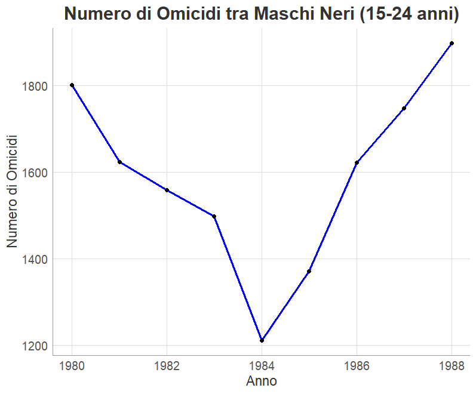
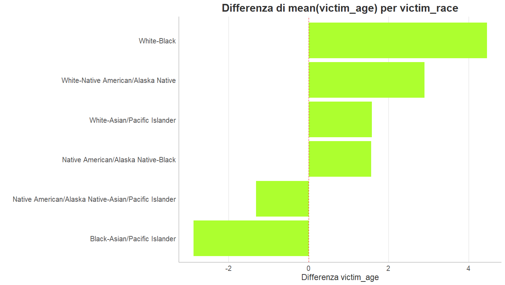
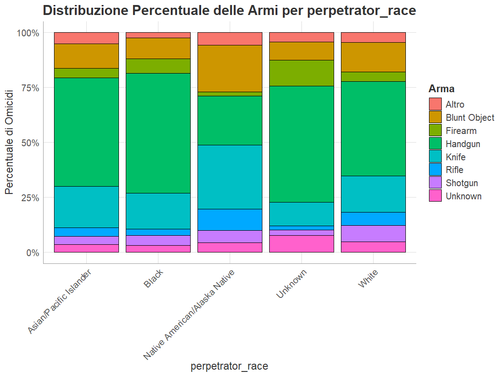
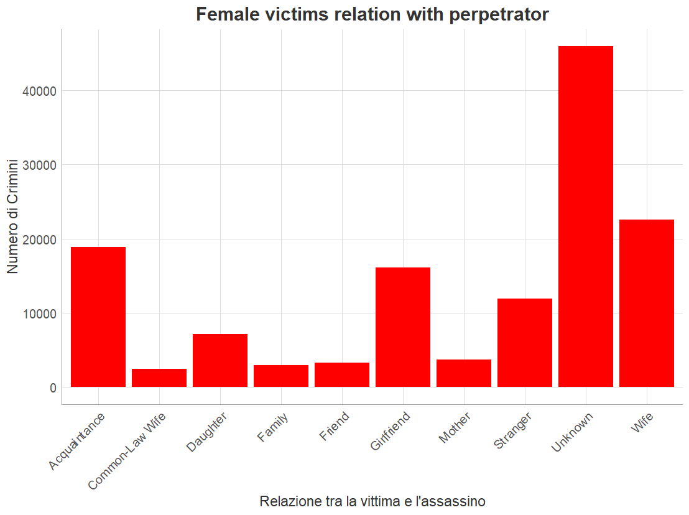
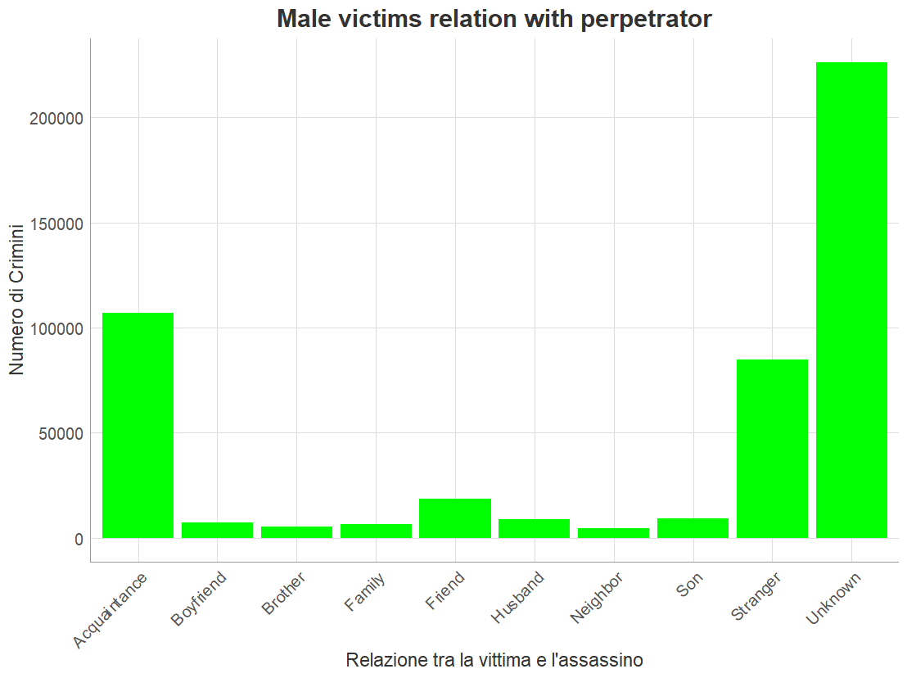
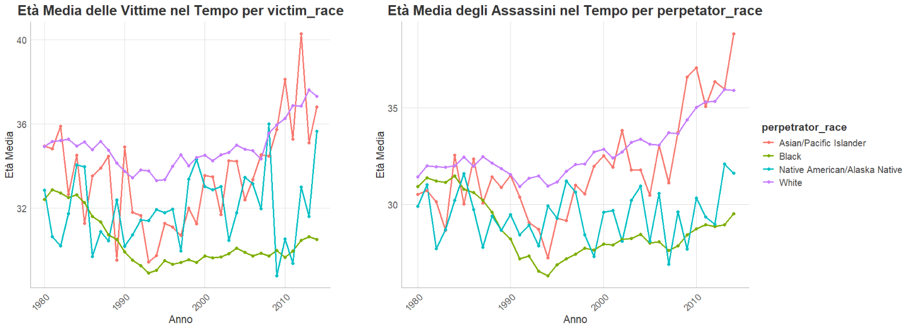

<p align="center">
  
  
  
  
  
  
</p>

# Study of Factors Associated with Homicides in the USA (1980-2014)

## Study Overview

This project presents a statistical analysis of homicides in the United States from 1980 to 2014, using the dataset from the [Murder Accountability Project](https://www.murderdata.org/). The purpose of this study was to verify the validity of specific claims reported by news outlets through rigorous statistical testing, providing a scientific basis for understanding patterns and trends in homicides in the USA.

## Objectives

### Main Objective
Verify the truthfulness of claims from news outlets regarding homicides in the United States, in particular:

1. **Increase in homicides among black men (15-24 years)**: Verification of the 66% increase between 1984 and 1988. [Source](https://www.nytimes.com/1990/12/07/us/homicide-rate-up-for-young-blacks.html)
2. **Intimate Partner Violence**: Analysis of percentages of homicides committed by intimate partners. [Source](https://bjs.ojp.gov/content/pub/pdf/htus8008.pdf)
3. **Demographic differences**: Study of victim age variations by ethnic group
4. **Temporal correlations**: Analysis of the evolution of victim and perpetrator age over time

### Secondary Objectives
- Analyze the relationship between demographic characteristics and crime resolution
- Identify patterns in weapon use by ethnic group
- Study relationships between victims and perpetrators by gender

## Repository Structure

```
├── README.md                                    # Project documentation
├── Script_murder_trends_verification_study.R    # Main R script
├── presentation.pdf                             # Presentation with results
└── grafici/                                     # Folder with visualizations
```

## Dataset Used

**Source**: [Murder Accountability Project](https://www.kaggle.com/datasets/murderaccountability/homicide-reports/data)  
**Period**: 1980-2014  
**Records**: 638,119 observations  
**Variables**: 22 main variables

### Variables under study
#### Categorical
- `crime_type`: Type of crime (Murder, Manslaughter by Negligence)
- `crime_solved`: Case resolution status (TRUE/FALSE)
- `victim_sex`, `perpetrator_sex`: Gender of victim and perpetrator
- `victim_race`, `perpetrator_race`: Ethnic group
- `weapon`: Weapon used
- `rel_victim_2_perp`: Relationship between victim and perpetrator (who the victim was to the murderer)
- `state`: Federal state

#### Numerical
- `victim_age`, `perpetrator_age`: Age of victim and perpetrator
- `year`: Year of crime

## Methodology

### Data Cleaning
1. **Standardization**: Variable renaming for consistency
2. **Outlier management**: Identification and treatment of illogical ages (0, 1, 99, 998)
3. **Coherence control**: Verification of logical relationships between variables (e.g., violated family logic: Perpetrators younger than victims but coded as Father/Mother of this person)
4. **Missing values management**: Conversion of "Unknown" values to NA where appropriate

### Statistical Approach
- **Hypothesis testing**: Comparison with specific journalistic claims
- **Confidence intervals**: Calculation of point estimates with error margins
- **Normality tests**: Distribution verification for numerical variables
- **Analysis of variance**: ANOVA for group comparisons
- **Independence tests**: Chi-square for categorical variables

## Statistical Tests Used

### 1. Proportionality Test
- **Objective**: Verification of percentages reported in media
- **Method**: Comparison with 95% confidence intervals
- **Application**: Intimate partner violence analysis and demographic trends

### 2. One-Way ANOVA
- **Test**: `aov(victim_age ~ victim_race)`
- **Post-hoc**: Tukey HSD test
- **Result**: p-value < 2e-16, significant differences between ethnic groups

### 3. Chi-Square Test
- **Weapons vs. Ethnic Group**: p-value < 2.2e-16, Cramer's V = 0.121
- **Gender vs. Relationship**: p-value < 2.2e-16, Cramer's V = 0.418
- **Interpretation**: Significant associations but of different intensity

### 4. Pearson Correlation
- **Year vs. Victim Age**: r = -0.011, weak negative correlation
- **Year vs. Perpetrator Age**: r = 0.018, weak positive correlation

## Main Results

### Verification of Journalistic Claims

#### 1. Black Men Homicides (15-24 years) - 1984-1988
**Claim**: 66% increase  
**Result**: 60.24% increase (CI: 60.24084-60.24117)  
**Conclusion**: **Null hypothesis rejected** - The increase was not 66%



#### 2. Intimate Partner Violence (1980-2008)
**Claim**: 16.3% of victims killed by intimate partner  
**Result**: 17.1% (CI: 16.968-17.229)  
**Conclusion**: **Null hypothesis rejected** - The percentage is significantly different

#### 3. Male Homicides by Intimate Partners
- **1980**: 10.21% (CI: 9.65-10.77) vs. 10.4% claimed - The percentage falls within the 95% confidence interval
- **2008**: 5.83% (CI: 5.18-6.48) vs. 4.9% claimed - The percentage does NOT fall within the 95% confidence interval

### Demographic Analyses

#### Age Differences by Ethnic Group
- **ANOVA Test**: P-value ANOVA: <2e-16
- **Tukey HSD**: All post-hoc comparisons are significant
  




#### Weapons-Ethnic Group Relationship
- **Significant association** ( p < 0.001)
- **Cramer's V = 0.121**: Weak-moderate association
- **Observed patterns**: Differences in firearm vs. other weapon use




#### Gender and Victim-Perpetrator Relationships
- **Very strong association** (Cramer's V = 0.418)
- **Female victims**: Higher prevalence of intimate/family relationships
- **Male victims**: Higher prevalence of acquaintances/strangers
<div style="display: flex; gap: 10px;">
  
  
</div>


### Temporal Trends

#### Evolution of Victim Age
- **Year-age correlation**: Weak but significant (r = -0.011)
- **Interpretation**: Slight decrease in average victim age over time
- **Variability by ethnic group**: Differentiated patterns between groups
  



## Skills Developed

### Technical Skills
- **R Programming**: Complex data manipulation with dplyr, tidyr
- **Statistical Analysis**: Parametric and non-parametric tests, ANOVA, logistic regression
- **Visualization**: Graph creation with ggplot2, theme customization
- **Data Cleaning**: Missing values management, outliers, inconsistencies

### Methodological Skills
- **Scientific Research**: Hypothesis formulation, rigorous testing
- **Critical Thinking**: Critical evaluation of media claims
- **Results Interpretation**: Translation of statistical outputs into practical insights
- **Data Communication**: Presentation of results for non-technical audience

### Transversal Skills
- **Problem Solving**: Systematic approach to analysis problems
- **Attention to Detail**: Precision in result interpretation

## Technical Requirements

### Required Software
- **R** (version ≥ 4.0.0)
- **RStudio** (recommended for development)

### Required R Packages
```r
# Data manipulation
library(dplyr)
library(tidyr)
library(stringr)
library(forcats)

# Data import
library(rio)

# Statistical analysis
library(nortest)      # Normality tests
library(DescTools)    # Descriptive statistics
library(rcompanion)   # Post-hoc tests
library(sjmisc)       # Statistical utilities

# Visualization
library(ggplot2)
library(scales)
```

## Limitations and Considerations

### Data Limitations
- **Underreporting**: Possible unreported homicides
- **Classification**: Variability in classification procedures between states
- **Missing Data**: Missing information for some key variables

### Methodological Limitations
- **Causality**: Correlations do not imply causal relationships
- **Generalizability**: Results specific to USA context
- **Temporal Trends**: Possible confounding factors not considered

## Conclusions

This analysis demonstrates the importance of rigorous statistical verification of media claims. The results highlight complex patterns in USA homicides, with significant demographic and temporal differences.

### Main Findings
1. **Media Accuracy**: Only some journalistic claims are statistically accurate
2. **Demographic Disparities**: Clear differences between ethnic and gender groups
3. **Temporal Evolution**: Significant changes over time

### Possible Future Developments
- Extension of analysis to more recent data
- Predictive models for identifying emerging patterns
- Detailed geographic analysis for regional variations

---

**Author**: Marco Ferrarini  
**Course**: Statistical Models (UFS06)
